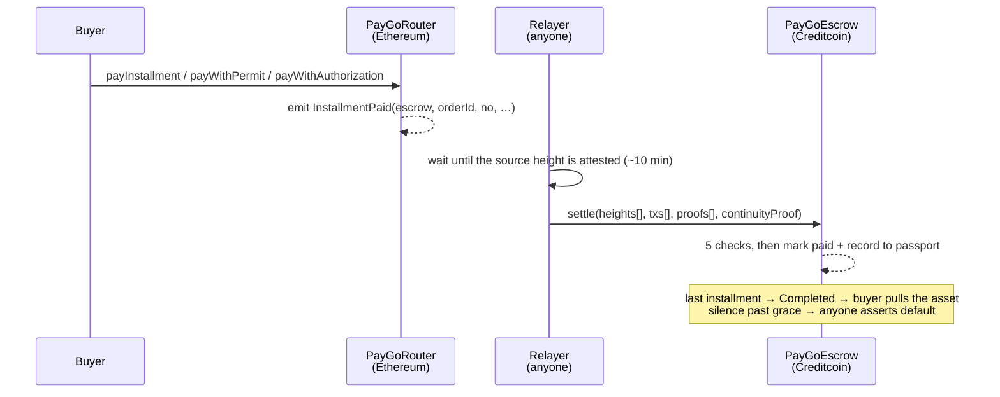

<div align="center">

# PayGo

**Trustless cross-chain hire-purchase**

Assets escrow on Creditcoin · installments settle in ERC-20 on Ethereum · a payment exists only once proven

[](https://github.com/4n0nn43x/paygo/actions/workflows/ci.yml)
[](LICENSE)
[](foundry.toml)
[](https://getfoundry.sh)

</div>

PayGo is a hire-purchase protocol: a seller escrows an asset and releases it to a buyer over a
fixed installment schedule, with no custodian, no price oracle and no liquidator. The escrow lives
on Creditcoin, the installments are paid in ERC-20 on Ethereum, and an installment only counts once
its Ethereum transaction has been proven to the escrow by the Attestcoin Protocol.

## Attestcoin Protocol integration

The Attestcoin Protocol is the only thing PayGo trusts. There is no oracle, no admin key and no
trusted relayer: an order advances only when an Ethereum transaction is proven to the escrow through
the protocol's precompiles, in the same Creditcoin transaction that applies the business logic. Every
capability below runs against the live CC3 testnet, not against a mock.

| Attestcoin Protocol capability | Where PayGo uses it | Verifiable by |
|---|---|---|
| `verifyAndEmit` on the BlockProver precompile `0x…0FD2` | `PayGoEscrow._verifyBatch`, before any state change | [settle, 1 proof](https://explorer.cc3-testnet.creditcoin.network/tx/0x818e27e885c5c8ceb754231548728e7157f7043d82a99300bf7674fd66d92469) |
| Batch verification: up to 10 queries under one shared continuity proof | `settle` and `settleCustody` take 1..10 proofs | [settle, 4 proofs](https://explorer.cc3-testnet.creditcoin.network/tx/0x2c0ddd628c85a57555c35e3095f1664a3aec6a574c68fa4a89a6596e0685c4ef), 159 912 gas per installment |
| Latest attested source height from the ChainInfo precompile `0x…0fD3` | `declareDefault`, as the protocol's clock: this is what makes asserting a default permissionless and oracle-free | [`PayGoEscrow.sol`](contracts/PayGoEscrow.sol) |
| `EvmV1Decoder`, the protocol's receipt and log decoding library | `PayGoEscrow._apply` and `_applyCustody`, linked at deploy time | [`script/deploy.sh`](script/deploy.sh) |
| Attestcoin SDK `@gluwa/usc-sdk@0.18.0`: `waitUntilHeightAttested`, `getBatchProof` | [`worker/settle.ts`](worker/settle.ts), the optional relayer | [`package.json`](package.json) |
| Source chain key 1, Sepolia on CC3 testnet, fixed at construction | escrow constructor, never a user parameter | [escrow](https://explorer.cc3-testnet.creditcoin.network/address/0x2D386703638C4f326f2CF27245F452E93585Ad8a) |

The protocol proves that a transaction was included; it does not interpret what was included. Turning
a valid proof into a valid payment takes five further checks, each written because of a property of
the precompile verified empirically: see [the five checks](#the-five-checks), and
[`docs/ARCHITECTURE.md`](docs/ARCHITECTURE.md) for why each one exists. Setup, deployment and the
proof pipeline step by step are in [`docs/BUILD.md`](docs/BUILD.md).

## Key properties

- **No price oracle.** A fixed schedule has no health factor. The asset is the collateral and its
  market price is never read, so there is nothing to manipulate and nothing to keep online.
- **No keeper, no liquidator.** The unhappy path costs nobody any gas until someone actually wants
  the asset back. Every entry point is permissionless: buyer, seller and third parties call the
  same functions.
- **Default is the default state.** An inclusion proof can attest that something happened; nothing
  can prove that it did not. So the protocol never tries to prove a missed payment: an overdue order
  can be asserted in default by anyone, and a proof of an on-time payment is what cures it.
- **Payment history as inclusion proofs.** Every settled installment is written to an ERC-5192
  soulbound record that the escrow reads back to size the next deposit. Each entry is a verified
  proof, not a self-reported claim.
- **Zero governance.** No admin, no upgrade path, no parameter setter. Allowlists and windows are
  fixed at construction; changing them means deploying again.

## How it works

Deadlines are Ethereum block heights, because the height is the only timestamp an inclusion proof
carries. The cure window is counted in Creditcoin blocks, because it measures time to *submit* a
proof. Conflating the two clocks is the mistake the design exists to avoid: a payment made before
its deadline stays valid however late its proof arrives.



Deadlines are quantised on `EPOCH = 1000` blocks, the spacing of the protocol's continuity
checkpoints, so payments belonging to *different* orders fall in the same window and settle
together: `settle` takes the 10 proofs the protocol allows under one shared continuity proof.

### Order lifecycle

```
Active ──all installments proven──▶ Completed ──▶ claimAsset (buyer, pull)
  │  ▲
  │  └── proof of an on-time payment (cure)
  ▼
DefaultAsserted ──cure window elapsed──▶ Defaulted ──▶ withdrawAsset (seller, pull)
```

`declareDefault` is permissionless and oracle-free: it compares the order's deadline against the
latest attested Ethereum height reported by the ChainInfo precompile. Asset transfers are pulled by
their recipient, never pushed inside `settle`, so a hostile or buggy ERC-721 can then only break its
own claim, not a shared settlement batch.

### The five checks

Every accepted proof passes these, in this order. Each exists because of a property verified
empirically against the precompile, noted alongside.

| # | Check | Why |
|---|---|---|
| 1 | Nullifier `keccak(chainKey‖height‖txIndex)`, marked before anything else | the precompile has no replay protection: the same proof verifies twice |
| 2 | `verifyAndEmit` over the whole batch | reverts on an invalid proof; it never returns false |
| 3 | `receiptStatus == 1` | the precompile does not check it: a failed transaction is perfectly provable |
| 4 | `log.address_ == ROUTER` and `topics[1] == address(this)` | log lookup filters on the event signature alone, so any contract can emit `InstallmentPaid` |
| 5 | Order open, installment unpaid, payee/token match, `amount ≥ due`, `height ≤ deadline` | business validity |

Checks 3–5 are *filters*, not assertions: a non-applicable log is skipped so that a griefer cannot
co-locate a poison log with a victim's payment and make it permanently unsettleable. Proof integrity
(1 and 2) stays a hard revert. `settleCustody` applies the same five checks to chip attestations.

### Proof-of-Custody

An inclusion proof shows that a payment happened; it says nothing about whether the physical item
behind a tokenised asset is the one that was listed. PayGo binds an EIP-5791 chip to the order: the
seller's chip signs at listing (Origin), the buyer's scan signs at delivery, and both attestations
reach the escrow through the same proof pipeline as payments.

A match is positive evidence (only the genuine chip can produce it) and releases the seller's
custody bond. A mismatch is deliberately *not* its mirror image: anyone can generate a keypair, so a
mismatch proves only that some other key signed. It therefore pays nobody and the bond is burned.
Paying the buyer would put a bounty on lying.

The bond is never denominated as a fraction of `price`: `price` is in the Ethereum-side payment
token and there is no CTC/token oracle. Introducing one would smuggle back the exact dependency the
payment side avoids.

## Repository layout

| Path | Chain | Contents |
|---|---|---|
| `contracts/PayGoRouter.sol` | Ethereum | stateless payment entry points: `payInstallment`, `payWithPermit` (EIP-2612), `payWithAuthorization` (EIP-3009); emits `InstallmentPaid` |
| `contracts/CustodyRouter.sol` | Ethereum | stateless chip attestation: `attestPossession`; emits `PossessionAttested` |
| `contracts/PayGoEscrow.sol` | Creditcoin | orders, `settle` / `settleCustody`, default state machine, pull-based asset and bond release |
| `contracts/CreditPassport.sol` | Creditcoin | ERC-5192 soulbound record of payment facts, read back by `createOrder` |
| `contracts/SellerPassport.sol` | Creditcoin | ERC-5192 soulbound record of custody facts; gates the bond requirement |
| `contracts/Attestcoin.sol` | Creditcoin | precompile interfaces: `0x…0FD2` BlockProver, `0x…0fD3` ChainInfo |
| `worker/settle.ts` | off-chain | optional relayer: submits pre-signed authorizations, batches proofs, calls `settle`; serves the web client |
| `web/app/` | off-chain | Vite + React client: listing, checkout, live schedule, passport |
| `docs/` | off-chain | [`BUILD.md`](docs/BUILD.md) setup and proof pipeline, [`ARCHITECTURE.md`](docs/ARCHITECTURE.md) design rationale, [`AUDIT.md`](docs/AUDIT.md) security reviews |

The relayer is a convenience, not a trust assumption. `settle` and `settleCustody` are
permissionless: a buyer who does not trust it can submit the identical proof themselves.

## Deployments

**Testnet only.** No mainnet deployment exists.

### Creditcoin CC3 testnet

| Contract | Address |
|---|---|
| PayGoEscrow | [`0x2D386703638C4f326f2CF27245F452E93585Ad8a`](https://explorer.cc3-testnet.creditcoin.network/address/0x2D386703638C4f326f2CF27245F452E93585Ad8a) |
| CreditPassport | [`0x2ad374C7AD03ec6e7e8677844E8c9581C7e1D697`](https://explorer.cc3-testnet.creditcoin.network/address/0x2ad374C7AD03ec6e7e8677844E8c9581C7e1D697) |
| SellerPassport | [`0x2b83a8AaCD93cEE5717d248D8995D68633dA6236`](https://explorer.cc3-testnet.creditcoin.network/address/0x2b83a8AaCD93cEE5717d248D8995D68633dA6236) |
| DemoAsset (ERC-721, test fixture) | [`0x205E75Bd48FB37B0489968D9A762b5D585a5ba77`](https://explorer.cc3-testnet.creditcoin.network/address/0x205E75Bd48FB37B0489968D9A762b5D585a5ba77) |

Both passports are deployed by the escrow's constructor. Escrow parameters: `chainKey = 1`
(Attestcoin's key for Sepolia on CC3, not the EVM chain id), `GRACE = 2000` Ethereum blocks,
`CURE_WINDOW = 240` and `CUSTODY_WINDOW = 240` Creditcoin blocks.

### Sepolia

| Contract | Address |
|---|---|
| PayGoRouter | [`0x083f9B08a2D2D392A8adcfdD3dDE479D71243e6e`](https://sepolia.etherscan.io/address/0x083f9B08a2D2D392A8adcfdD3dDE479D71243e6e) |
| CustodyRouter | [`0x7445286394fc27DF8E6b4455694A098A63887A0e`](https://sepolia.etherscan.io/address/0x7445286394fc27DF8E6b4455694A098A63887A0e) |
| TestUSDC (permit + EIP-3009, test fixture) | [`0xb25E65CA2650F9B4ce9C2B91A550EC85Bd3C3228`](https://sepolia.etherscan.io/address/0xb25E65CA2650F9B4ce9C2B91A550EC85Bd3C3228) |

The escrow rejects any order whose asset or payment token is not on its constructor allowlist, and
namespaces orders per deployment (`topics[1] == address(this)`), so addresses from one deployment
are inert against another.

## Local development

Requires [Foundry](https://getfoundry.sh) and Node 22+.

```sh
npm i
forge test            # 59 tests; RealProof.t.sol needs a captured proof fixture and is excluded in CI
npm run build:web     # web/app → web/dist
```

Solidity 0.8.30, optimizer on at 200 runs, `evm_version = "shanghai"`. `EvmV1Decoder` is an external
library and must be linked at deploy time, see `script/deploy.sh`.

Running against testnet:

```sh
cp .env.example .env    # private key, RPC endpoints, deployed addresses
sh script/deploy.sh     # deploys both sides and fills in the addresses
npm run worker          # relayer + web client on :8787
node script/gas-probe.mjs
```

`script/demo.sh` drives a full order lifecycle from the command line: `order`, `pay`, `default`,
`finalize`, `claim`, `withdraw`, `show`, `passport`, `attest-origin`, `attest-delivery`,
`withdraw-bond`, `claim-bond`.

## Security

No third-party audit. What has been done instead:

| Review | Scope | Outcome |
|---|---|---|
| Internal pre-deployment review | contracts | 1 high, 2 medium, 2 low; all fixed or documented as accepted |
| Automated multi-agent review, 2026-08-31 | contracts + relayer | 3 findings survived refutation with executed proofs of concept; 1 candidate refuted |
| Automated multi-agent review, 2026-09-03 | full surface | 7 findings (1 critical, 3 high, 2 medium, 1 low), all fixed |
| Web client review | client + relayer HTTP surface | 4 findings, all fixed |
| Static analysis | Slither, Aderyn, `forge coverage` | no protocol-level finding of their own |

Every finding ships with a regression test. Full write-ups, including the accepted residual risks
and the findings that were reproduced then refuted, are in [`docs/AUDIT.md`](docs/AUDIT.md);
individual reports are under [`audit/findings/`](audit/findings).

Two residual risks are accepted by design and worth stating plainly:

- **Passport collusion.** Two cooperating wallets can manufacture payment history by completing real
  orders between themselves. Permissionless reputation without identity cannot prevent this. The
  passport is a deposit discount, never a security boundary: the asset stays escrowed and reverts
  to the seller on default whatever the buyer's record says.
- **Self-forged custody.** A seller can attest both Origin and Delivery on a sham order using a
  throwaway chip. Proof-of-Custody detects substitution between listing and delivery; it does not
  establish that a chip was ever attached to a real object.

Every scan gating this repository runs in CI: `forge test`, gitleaks over the full history, Semgrep,
Trivy against the built image, and zizmor against the workflows themselves. All scanners are pinned
by image digest and all actions by commit SHA.

To report a vulnerability, open a private security advisory on this repository rather than a public
issue.

## Measured gas

Real proofs against CC3 testnet, not estimates. Each row links its transaction.

| Scenario | Total gas | Per installment | Transaction |
|---|---|---|---|
| 1 fresh proof | 357 476 | 357 476 | [`0x818e…2469`](https://explorer.cc3-testnet.creditcoin.network/tx/0x818e27e885c5c8ceb754231548728e7157f7043d82a99300bf7674fd66d92469) |
| 3 proofs, one continuity proof | 528 416 | **176 139** (−51 %) | [`0x8b12…7847`](https://explorer.cc3-testnet.creditcoin.network/tx/0x8b123684246c82263336be169f0b5830ebdfdf6a467801e69f9857adddc47847) |
| 4 proofs, one continuity proof | 639 646 | **159 912** (−55 %) | [`0x2c0d…c4ef`](https://explorer.cc3-testnet.creditcoin.network/tx/0x2c0ddd628c85a57555c35e3095f1664a3aec6a574c68fa4a89a6596e0685c4ef) |

Proof freshness, measured at the precompile with `node script/gas-probe.mjs` against attested height
11 524 740:

| Proof age | Continuity roots | `verify()` gas |
|---|---|---|
| ~10 min | 1 | 43 748 |
| +6 h | 61 | 85 665 |
| +24 h | 62 | 84 284 |
| +7 d | 62 | 86 127 |

An aged proof costs roughly twice a fresh one (the prover anchors on the nearest checkpoint, about
60 roots) and stays flat beyond that. Batching is the larger lever; freshness is the second.

Every figure here is reproducible: `node script/gas-probe.mjs` re-runs the freshness probe against the
deployed precompile.

## License

MIT. See [`LICENSE`](LICENSE).

This software is provided without warranty of any kind. It has not been audited by a third party and
has never been deployed to a production network.
